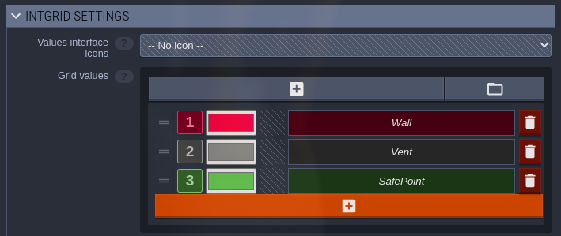

# Byte Engine

Revamped base game engine for use in NDACM Byte-le Royale games.
Changes made in 2023.

## Important Changes

* Overall Change
  * Every file is now type hinted to facilitate the coding process. For future development,
  type hint any changes made for the same reason.
  

* Item Class
    * The item class has many parameters that can be used in a few different ways to allow
    for flexibility.

    * Value:
      * This allows for an item to have a value of some sort. This can be used to determine
      points gained for collecting the item, or its sell price. The meaning can change depending 
      on the project.
      
    * Durability:
      * Durability can represent how many uses an item has. What happens after is determined by 
      the development team.
    
    * Quantity:
      * This allows for consolidating and representing multiple items in a single item object.

    * Stack Size:
      * Stack Size determines how many item objects can be consolidated together into a single 
      object at once. This can be thought of as a denominator in a fraction.
    
    * Reference the Item class for further documentation.


* GameBoard Class
  * GameBoard Seed Parameter
    * There is a new parameter in the GameBoard class that allows 
    a specific seed to be set. This can be used to help with testing during game development.
    
  * Map Size Parameter
    * This is a Vector object that is not used as a coordinate, but the dimensions of the 
    entire game map. Vectors are explained later.
    
  * Locations Parameter
    * This parameter allows for user-defined specifications of where to put certain GameObjects 
    on the game map. It is an extensive system used to do this, so refer to the file for 
    further documentation.

  * Walled Parameter
    * This is a boolean that determines whether to place Wall objects on the border of the game 
    map.


* Occupiable Class
  * A new class was implemented called Occupiable. This class inherits from GameObject and 
  allows for other GameObjects to "stack" on top of one another. As long as an object inherits 
  this class, it can allow for many objects to be located on the same Tile.

 
* Tile Class
  * The Tile class inherits from Occupiable, allowing for other GameObjects to stack on top of
  it. A Tile can be used to represent the floor or any other basic object in the game.


* Wall Class
  * The Wall class is a GameObject that represent an impassable object. Use this object to help 
  define the borders of the game map.


* Stations
  * Station Class
    * The Station represents a basic Station. They can contain items and be interacted with.
    
  * Occupiable Station
    * Occupiable Stations represent basic Station objects that can be occupied by another 
    GameObject.
    
  * Example Classes
    * The occupiable_station_example, station_example, and station_receiver_example classes 
    are provided to show how their respective files can be used. These can be deleted or used
    as templates on how to expand on their functionality. 


* Action Class
  * This is a class to represent the actions a player takes each turn in object form. This is 
  not implemented in this version of the engine since enums are primarily used.


* Avatar Class
  * The Avatar class is newly implemented in this version of the byte-engine and includes
  many new features.
  
  * Position:
    * The Avatar class has a parameter called "position" which is a Vector object (explained 
    later in this document). This simply stores the Avatar's coordinate on the game map.
    
  * Inventory:
    * There is an inventory system implemented in the Avatar class now. You are able to specify 
    the max size of it, and there are methods that are used to pick up items, take items from 
    other objects, and drop the Avatar's held item.
    
  * Held Item:
    * The held item of an Avatar is an item that the Avatar has in their inventory. This is done 
    by using enums. Reference the enums.py file for more information.
    
  * These changes are provided to allow for development to go smoothly. Developers are not obliged 
  to use nor keep any of these changes. The inventory system and any other aspect of the class may be 
  modified or removed as necessary for game development.


* Enums File
  * This file has every significant object being represented as an enum. There are also enums
  that help with the avatar's inventory system. Refer to the file for a note on this.


* Player Class
  * The player class now receives a list of ActionType enums to allow for multiple actions 
  to happen in one turn. The enum representation can be replaced with the Action object 
  if needed.


* Avatar VS Player Classes
  * These two classes are often confused with each other. Here are their differences.
  * Avatar:
    * The Avatar class represents the character that is in the game. The Avatar is 
    what moves around, interacts with other GameObjects, gains points, and whatever else 
    the developers implement.

  * Player:
    * The Player object encapsulates the Avatar class and represents the physical 
    people competing in the competition. This is why it has parameters such as team_name.
    It is also why the controllers take a Player object as a parameter and not an Avatar
    object; it helps manage the information gathered for the individual competitors/teams for
    the final results.


* Controllers
  * Interact Controller Class
    * This class controls how players interact with the environment and other GameObjects.
  
  * Inventory Controller Class
    * This class controls how players select a certain item in their inventory to then 
    become their held item.
  
  * Master Controller Class
    * This controller is used to manage what happens in each turn and update the 
    overarching information of the game's state.
  
  * Movement Controller Class
    * This class manages moving the player through the game board by using the given enums.


* Generate Game File
  * This file has a single method that's used to generate the game map. The 
  generation is slow, so call the method when needed. Change the initialized 
  GameBoard object's parameters as necessary for the project.
  
 
* Vector Class
  * The Vector class is used to simplify handling coordinates. 
  Some new implementations include ways to increase the values of an already existing Vector,
  adding two Vectors to create a new one, and returning the Vector's information as 
  a tuple.


* Config File
  * The most notable change in this file is MAX_NUMBER_OF_ACTIONS_PER_TURN. It is used for 
  allowing multiple actions to be taken in one turn. Adjust as necessary.

## [LDtk](https://ldtk.io/) Integration

`game/utils/ldtk_helpers` now contains functions for parsing .ldtk project files.
To use them, your LDtk project ***must***:

* contain two layers:
  * an integer grid named **"Collisions"**
  * an entities layer named **"Entities"**
* disable the "Save levels to separate files" option (as of writing it is disabled by default)

Integer grid values, enums, or any other important identifiers defined in the LDtk project
should be defined as constants in the `LDtk` class in `game/config` for maintainability.

For example, the following integer grid values (in this case they map to different types of "collidable" tiles)



should have config values set to:

```py
# game/config.py
class LDtk:
  ...
  class CollisionType:
    NONE = 0
    WALL = 1
    VENT = 2
    SAFE_POINT = 3
  ...
```

These constants can then be used in your implementation to safely refer to editor-defined values
like so

```py
match collision_type:
  case LDtk.CollisionType.NONE:
    pass
  case LDtk.CollisionType.WALL:
    # place wall
  case LDtk.CollisionType.VENT:
    # place vent
  case LDtk.CollisionType.SAFE_POINT:
    # place safe point
  case _:
    raise ValueError(f'unknown collision type: {collision_type}')
```

### Using `LDtkJson`

Most of the heavy lifting is currently done by an
[importer provided by LDtk](https://ldtk.io/files/quicktype/LdtkJson.py),
so all we have to do is find what we need in the `LdtkJSON` object returned by `ldtk_json_from_dict` or `LdtkJSON.from_dict`. To do so, we first need to know a little bit about the structure of our .ldtk file. To keep things simple, just look at this diagram from [here](https://ldtk.io/docs/game-dev/json-overview/):


For more details about the .ldtk format, see [their docs](https://ldtk.io/docs/game-dev/json-overview/).

For instance, if we want to access all the entities we placed in LDtk, we choose a level, find an entity layer, and then iterate over that layer's entities.
Using the `LdtkJSON`, that might look something like:

```py
ldtk_json = ldtk_json_from_dict(json_data)
first_level = ldtk_json.levels[0]

# note the addition of "_instances" instead of an "s"
for layer in first_level.layer_instances 

  # valid values of LayerInstance.type are documented in LDtkJson
  if layer.type != 'Entities': 
    continue

  for entity in layer.entity_instances:
    # do entity stuff
```

Or, if we have some `EntityInstance` and we want to instantiate a Python object with values defined in LDtk, we must iterate over `EntityInstance.field_instances`

```py
class CustomEntity:
    @classmethod
    def from_ldtk_entity(cls, entity: EntityInstance) -> Self:
      foo = -1
      bar = []
      for field in entity.field_instances:
        match field.identifier:
            case 'foo_name_in_ldtk':
              foo = field.value
            case 'bar_name_in_ldtk':
              for element in field.value:
                bar.append(element)
      return cls(foo=foo, bar=bar)
```

### Prioritized entity loading

If you need to load certain types of entities before or after others, you can add an entry to `ENTITY_LOAD_PRIORITY` in `game/utils/ldtk_helpers`:

```py
"""
unspecified entities have a default priority of 0
highest = first; lowest = last
"""
ENTITY_LOAD_PRIORITY: dict[str, int] = {
  LDtk.EntityIdentifier.A: 0, # optional; unspecified entities have priority of 0
  LDtk.EntityIdentifier.B: -9999, # load before A
}
```

## Development Notes

* Type Hinting
  * Type hinting is very useful in Python because it prevents any confusion on
  what type an object is supposed to be, what value a method returns, etc. Make 
  sure to type hint any and everything to eliminate any confusion.
* Planning
  * When planning, it's suggested to write out pseudocode, create UMLs, and any 
  other documentation that will help with the process. It is easy to forget what 
  is discussed between meetings without a plan. 
  * Write everything that should be implemented, 
  what files need to be created, their purpose in the project, and more. UML diagrams 
  help see how classes will interact and inherit from each other. 
  * Lastly, documentation is a great method to stay organized too. Having someone to 
  write what is discussed in meetings can be useful; you won't easily lose track of 
  what's discussed.


## How to run

### Windows
```bash
.\build.bat # will compile your code

python .\launcher.pyz g # will generate a map 

python .\launcher.pyz r # will run the game
```

### Linux
```bash
./build.sh # will compile your code

python launcher.pyz g # will generate a map 

python launcher.pyz r # will run the game
```

Note: if running the launcher throws a ModuleNotFoundError, make sure your Python virtual environment is activated via:
```bash
# in the root directory
source .venv/bin/activate
```

## Required Python Version

- Requires Python 3.11 due to type of Self

## Test Suite Commands:

```bash
python -m game.test_suite.runner
```

## Manual

[Usage Manual](https://docs.google.com/document/d/1MGxvq5V9yGJbsbcBgDM26LugPbtQGlyNiaUOmjn85sc/edit?usp=sharing)

Referenced Examples - https://github.com/topoftheyear/Byte-le-Game-Examples

## Previous Byte-le Competitions

2018 - Dungeon Delvers - https://github.com/jghibiki/Byte-le-Royale-2018

2019 - Space Denizen - https://github.com/topoftheyear/Byte-le-Royale-2019

2020 - Disaster Dispatcher - https://github.com/PixPanz/byte_le_royale_2020

2021 - Traveling Trailsmen - https://github.com/PixPanz/byte_le_royale_2021

2022 - FarTech - https://github.com/HagenSR/byte_le_royale_2022

2023 - Undercooked - https://github.com/amanda-f-ndsu/byte_le_royale_2023

2024 - Quarry Rush - https://github.com/acm-ndsu/Byte-le-2024

2025 - Commander Clash - https://github.com/acm-ndsu/Byte-le-2025
