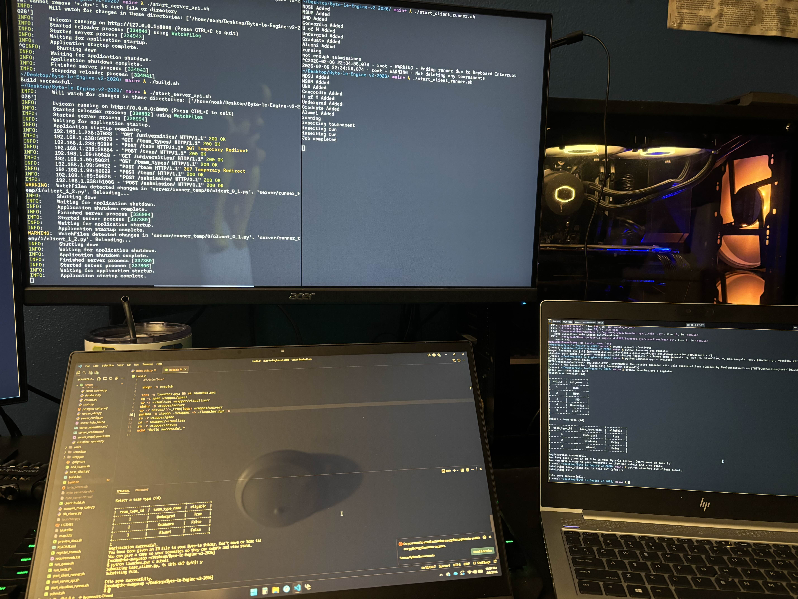
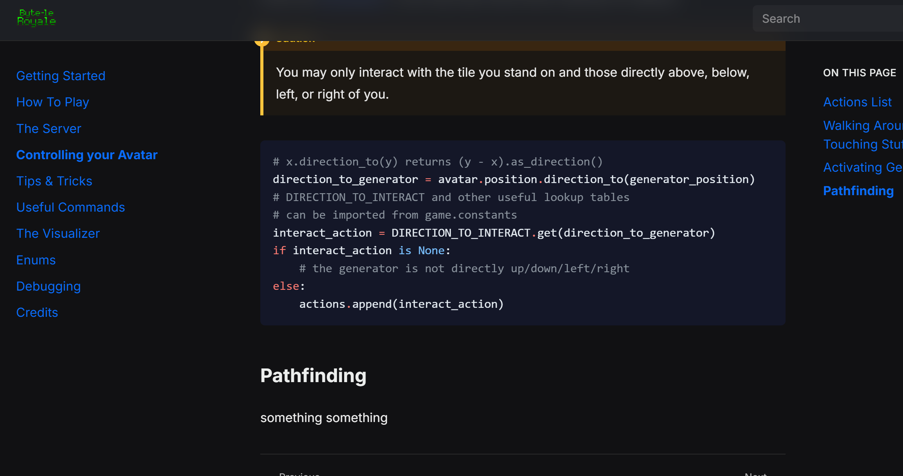
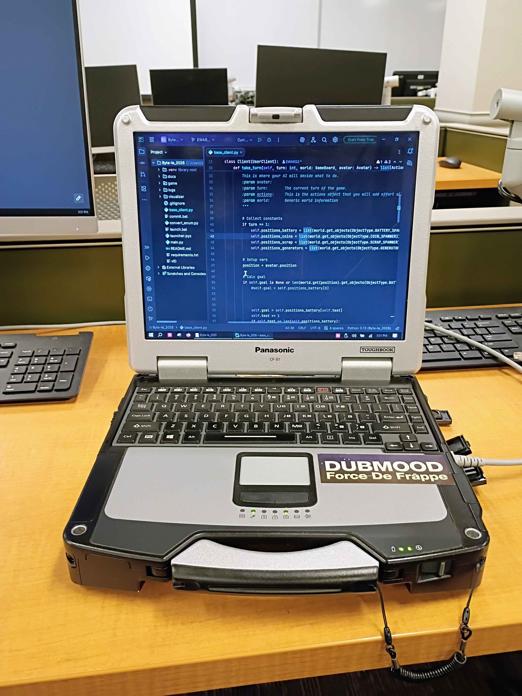

author (noah) notes written like [ note in here ]

timestamps based on git commits and discord

# BYTELE EVE (2026-02-06)

- client package deploy action is down (private repo, reached max alloted minutes the day before)
- docs are down (private repo, gh pages)

18:11

begin debugging "CLIENT RUNNER NONSENSE"

19:06

ian agrees to go to linux lab to test internal runner after earlier tests failed

22:02

ian is locked out of linux lab

22:11

i start testing locally

---

beb (noah) — 2/6/26, 22:38
guys the game Definitely works

---

King_Philip — 2/6/26, 23:28

do y’all have the client name being displayed on the visualizer?

beb (noah) — 2/6/26, 23:28

[ skull emoji react from ian and gunnar ]

# TWILIGHT OF BYTELE (2026-02-07)

00:03

i finish adding the client name to visualizer

00:33 

gunnar mentions how to fix leaderboard printing twice

---

beb (noah) — Yesterday at 00:35

I legit just got tucked in and my phone buzzed

King_Philip — Yesterday at 00:35

go rest noah 🤣

beb (noah) — Yesterday at 00:35

1 more client build...
[ despair react from ian and gunnar ]

---

00:42

leaderboard fix pushed to main

00:47

finish manually building/deploying client package 

i go to bed

--- 

beb (noah) — Yesterday at 01:00

TODO: EXPLAIN HOW TO UPDATE CLIENT PQCKAGE
IN SOCS

beb (noah) — Yesterday at 01:16

FIXME: UNHARDCODE VISUALIZER TEAM NAME

# THE BYTE OF '26

07:??
- wake up
- shower
- explain updating in docs
- unhardcode visualizer client name
- push
- "branch has diverged"
- open github repo on website

\> docs down

08:22
- ian adds built documentation to docs
- ian switches gh pages branch to main and folder to docs

\> docs down

08:26
- i add changes from before
- builtin gh pages deploy succeeding
- custom gh pages deploy failing to build because of sphinx-tabs

\> docs down

08:37
- i remove sphinx-tabs
- both deploy actions succeeding

\> docs down

---

beb (noah) — Yesterday at 08:46

ok both deploys succeeded well just have to wait and see if it comes back up

King_Philip — Yesterday at 08:47

still a 404

beb (noah) — Yesterday at 08:47

wait bratha wait

King_Philip — Yesterday at 08:47

from the most recent deploy, i'm still getting a 404 to the website

beb (noah) — Yesterday at 08:48

yes gh pages isnt instant

i think i read something about 10 minutes [ <<< how clueless is this guy LOL ]

---

08:53
- ian adds .nojekyll file to docs
- both deploy actions succeeding

\> docs still down

09:11
- gunnar adds built docs to client package manually

\> docs still down

09:59
- im tweaking random stuff 

\> docs still down

10:16
- last random tweak

\> docs still down

10:??
- transfer repo to acm org
- i get perms to view settings
- set branch to gh-pages

\> docs still down

- set folder to root

\> docs up

---

King_Philip — Yesterday at 10:23

@everyone The docs website is live! 
https://ndacm.org/Byte-le-Engine-v2-2026/
GO CRAZYYYYYYYY 🤪

---

King_Philip — Yesterday at 10:40

@everyone **DO NOT UNPACK THE LAUNCHER** >:(

\[ 7x skull react ]

---

### Dr. Art — Yesterday at 11:22
noah...

Stuff coming your way

sighhhhhh

### beb (noah) — Yesterday at 11:22

### King_Philip — Yesterday at 11:22

my guy LOL

### beb (noah) — Yesterday at 11:24

im gonna put all of the pathfinding code there in a big block

[ skull react by ian ]

### beb (noah) — Yesterday at 11:26

@Byte-le Dev any objections 👁️

### King_Philip — Yesterday at 11:27

is pathfinding supposed to be the biggest challenge they overcome? if so, i wouldn't provide it

### beb (noah) — Yesterday at 11:27

NO

ACTUALLY MAYBE

idk we didnt really make a decision

and if we did then Mb

### King_Philip — Yesterday at 11:28

pathfinding looks like it's supposed to be the biggest challenge for this, so it shouldn't be provided honestly

### beb (noah) — Yesterday at 11:29

me AND CAITLIN YES @Caitlin both had bad times trying to figure out pathfinding so im going to say that it should not be

giving a* just means that you can actually Play The Game and get to think about grander strategy

### King_Philip — Yesterday at 11:29

so everyone else should canonically also have a bad time with pathfinding :D agree

### beb (noah) — Yesterday at 11:30

No dude

### King_Philip — Yesterday at 11:30

oh you're saying to provide it?

### beb (noah) — Yesterday at 11:30

YES

### Dr. Art — Yesterday at 11:30

OK do we provide it or not

### beb (noah) — Yesterday at 11:30

YES

### King_Philip — Yesterday at 11:30

okay got it

### Dr. Art — Yesterday at 11:30

OKAY

### beb (noah) — Yesterday at 11:30

OKAY ITS GOING LIVE SOON™

### King_Philip — Yesterday at 11:31

before it goes live

### Dr. Art — Yesterday at 11:31

wait

### Caitlin — Yesterday at 11:35

What to do with a*

Provide a* 4 votes 57%

Show link to how to do a* and do not provide map 3 votes 43%

---

12:43 

- docs go live with sample A* code

13:11

- i realize the code includes unallowed [ at the time ] modules 

14:50 

- A* modules and others [ for a team building a machine learning client ] are officially allowed

---

player wants visualizer window to be scalable because they are using a 2010 Panasonic Toughbook

player asks if they can remove Zero Point One Second client timeout limit because theyre using a 2010 Panasonic Toughbook

the toughbook in question:

---

\> player: "bot stun isnt working" 
\> bot stun has been working since beginning 
\> dev (with pocket me) visits them to troubleshoot 
\> player was running visualizer in 4x 
\> player couldnt see the bot getting stunned bc they were dying 
